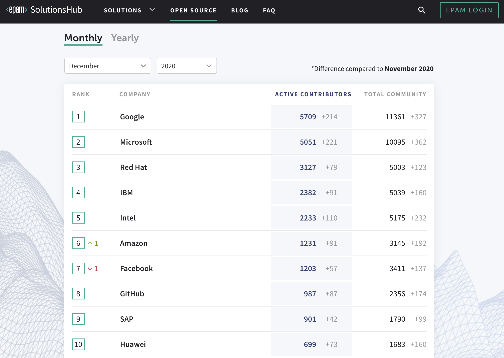
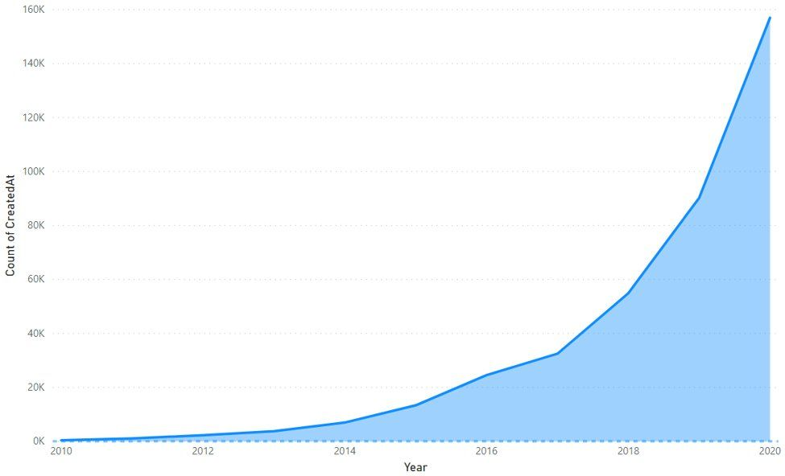
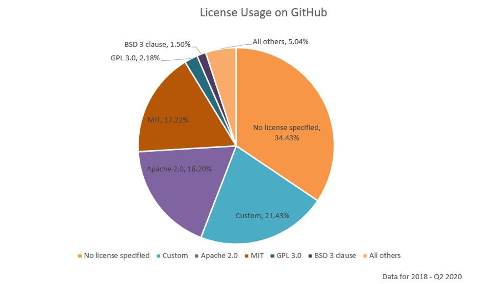
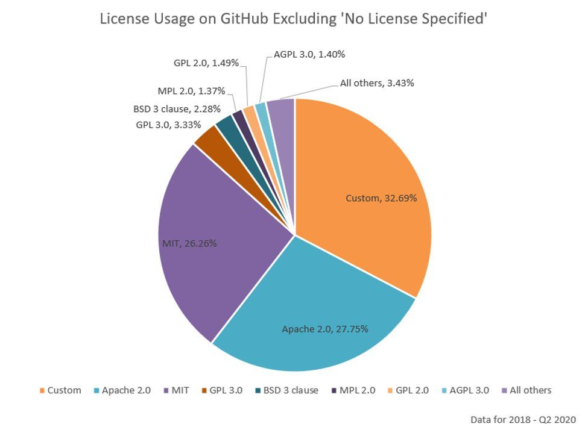
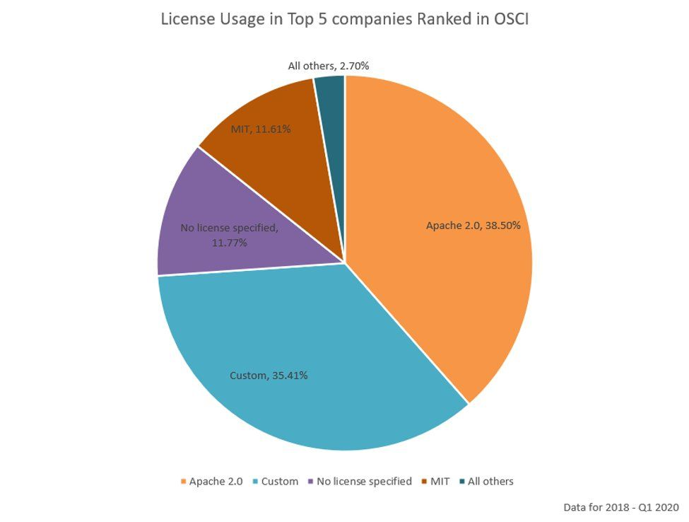
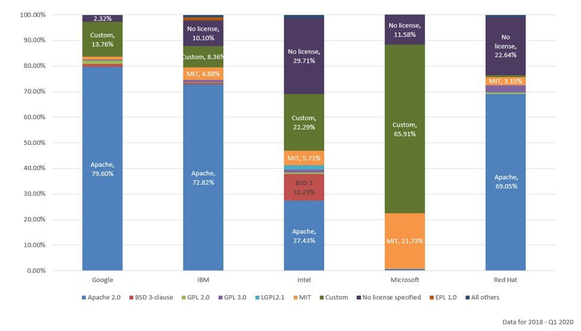
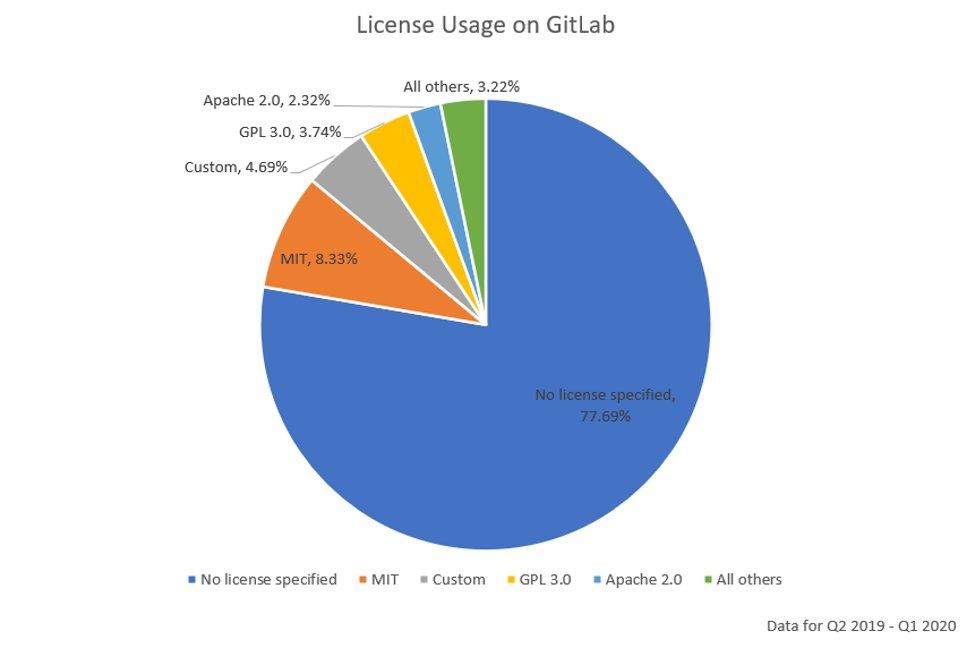
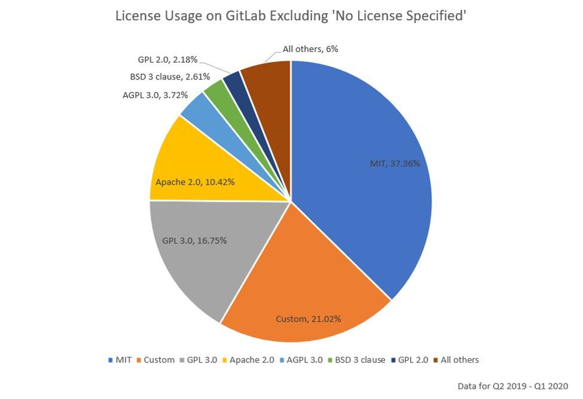

## EPAM, 2020년도 기업별 Github 활동 순위와 라이선스 현황 (OSCI)

Enterprise Software 개발 및 컨설팅을 하는 [EPAM](https://www.epam.com/) 에서는 Github 사용량을 측정하여 [OSCI (Open Source Contributor Index)](https://solutionshub.epam.com/osci) 이라는 랭킹 서비스를 제공하고 있습니다.
공개적으로 활용 가능한 Github 커밋 이벤트 데이터를 사용하여 상업 조직의 구성원들의 기여를 측정합니다. 대학, 연구기관 및 무료 이메일 공급자의 기여는 포함되지 않았다고 합니다. 10개 이상의 커밋을 수행한 기여자가 대상이며, 자체 연구한 알고리즘에 의해 활동량 점수를 측정한다고 합니다. 알고리즘은 [OSCI Github](https://github.com/epam/OSCI) 에 공개되어 있습니다.

### OSCI (Open Source Contributor Index)
[https://solutionshub.epam.com/osci](https://solutionshub.epam.com/osci)

분석 점수에 따르면 구글이 선두에 위치해 있으며, 마이크로소프트, 레드햇이 각각 다음 순위를 차지했습니다. 한국 기업으로는 삼성이 29위, LG 전자가 71위에 랭크 되어 있습니다. 

## 기업별 라이선스 현황
OSCI를 통해 수집된 데이터로 추출된 [오픈소스 라이선스 사용조사](https://solutionshub.epam.com/blog/post/examining-open-source-license-usage) 도 주목해 볼만 합니다. Google Big Query 같은 툴을 이용하여 측정은 가능했지만 어뷰징 제거 등 유효한 데이터 필터링 안되어서 신뢰도가 낮은편이었는데, OSCI를 구축하면서 의미있는 Github 저장소들을 대상으로 통계를 낸 거라 유용할 것으로 보입니다.

2018 년 초부터 2020 년 중반까지 GitHub에서 생성 된 새로운 공용 리포지토리의 라이선스 선택을 조사했으며, 인기있는 오픈 소스 호스팅 플랫폼의 패턴을 비교하기 위해 GitLab에서 1 년간의 데이터도 함께 연구했다고 합니다.

### GitHub 새로운 Repository의 급격한 증가

GitHub에서 생성 된 리포지토리 수가 지난 2 년 반 동안 급격하게 증가하고 있음을 보여줍니다. 이러한 오픈소스의 증가세는 특히 주목해야 하는 트랜드입니다.

### 2018 년 이후 라이선스 사용 동향
2018 년 초부터 생성 된 저장소를 살펴보면 몇 가지 추세가 두드러집니다. 

- 리포지토리의 34 %가 라이선스 파일을 포함하지 않아 오픈 소스 상태에 문제가 있습니다.
- 리포지토리의 21 %가 GitHub에서 표준 라이선스 유형으로 인식되지 않습니다. 이는 일반적으로 라이선스 파일에 사용자 정의 라이선스 텍스트가 포함되어 있기 때문입니다. 종종 표준 라이선스 텍스트의 사소한 편집 만 포함합니다. 마지막으로, 가장 중요한 것은 Apache 2.0과 MIT가 가장 많이 사용되는 두 가지 라이선스 유형이며 전체 저장소의 총 35 % 이상입니다.

라이선스 파일이없는 리포지토리를 제외하면, 리포지토리의 절반 이상이 Apache 2.0 또는 MIT 라이선스를 사용합니다. 리포지토리의 1/3은 특정 형태의 사용자 지정 라이선스 텍스트를 사용하며 나머지 13 %에는 BSD 및 Gnu Public License의 변형이 가장 일반적인 다양한 라이선스가 포함되어 있습니다.

GitHub의 조언에도 불구하고 라이선스 파일없이 생성 된 리포지토리. 데이터는 많은 개별 기여자들이 오픈 소스 프로젝트에 라이선스 파일을 포함하는 것의 중요성을 이해하지 못하고 있음을 시사합니다.

### OSCI 순위 상위 5 개 회사의 라이선스 사용
상업 조직에 대한 그래프는 GitHub에서 분석 한 모든 리포지토리와 비교하여 다른 차트를 보여줍니다. Apache 2.0은 지금까지 가장 많이 사용되는 라이선스이고 그 다음으로 사용자 지정 라이선스 텍스트가 있습니다. MIT 라이선스는 상당한 인기를 얻은 유일한 다른 표준 라이선스입니다. **카피 레프트 라이선스는 거의 사용되지 않습니다.** 마지막으로, 라이선스 파일이없는 리포지토리 수가 적지 않습니다. 샘플을 수동으로 연구 한 후에는 대부분 코드가 아닌 저장소 (예제 또는 문서)입니다.

상위 5개 기업을 각각 개별적으로 살펴보면 그 결과가 흥미롭고 기업 선호도가 서로 다릅니다.

Apache는 Google, IBM 및 Red Hat에서 가장 선호하는 라이선스입니다. Microsoft에서 대부분의 라이선스는 사용자 지정 텍스트이며 MIT가 다음으로 선호되는 표준 라이선스 유형입니다. 사용자 지정 라이선스 텍스트 중 일부를 수동으로 검토 한 결과 실제로 MIT (코드 저장 소용) 및 CreativeCommons (문서 용)가 종종 있음을 발견했습니다.

대조적으로 Intel은 훨씬 더 다양한 라이선스 유형을 사용하는 것으로 보이며 Apache가 가장 선호되고 사용자 지정 라이선스 텍스트와 3-Clause BSD가 그 뒤를 따릅니다. Intel 용 리포지토리의 사용자 지정 라이선스 텍스트에 대한 수동 연구는 Apache 2.0, 3-Clause BSD 및 기타 표준 라이선스 유형을 기반으로 한 혼합 텍스트를 보여줍니다.

### GitLab 분석
2019 년 2 분기부터 2020 년 1 분기 말까지 12 개월 동안 GitHub 결과와 매우 다른 패턴이 나타 났습니다. 특히 이 기간에 생성 된 공용 저장소의 77.7 %는 라이선스 파일이 없습니다. 이것은 개발자가 오픈 소스 라이선스 선택의 필요성과 가치를 다시 한번 인식하지 못한다는 것을 의미합니다. 또한 GitLab과 GitHub에서 오픈 소스 프로젝트를 만드는 사용자의 일부 차이를 반영 할 수 있으며 기업 사용에 비해 개별 사용이 더 많습니다.

라이선스 파일이없는 리포지토리를 제외하면 아래 이미지는 MIT가 37 %로 가장 인기가 많았고, 사용자 지정 라이선스 텍스트가 21 %, GPL 3.0이 17 %, Apache 2.0이 10 %로 그 뒤를이었습니다. GitLab에서 요약하면 허용 라이선스 유형이 다시 가장 많이 사용되는 유형이지만 MIT가 리더이며 Apache 2.0 사용량은 GitHub보다 훨씬 적습니다. 카피 레프트 라이선스는 GitLab과 GitHub에서 비슷하게 적은 점유율을 가지고 있습니다.

## 결론
다음과 같은 많은 흥미로운 결과를 보여줍니다.
- Apache 2.0 및 MIT가 확실한 리더로서 허용 라이선스 유형에 대한 추세가 증가하고 있습니다.
  카피 레프트 라이선스 유형은 약간 사용됩니다.
- 라이선스 없이 생성되는 저장소가 점점 늘어나고 있으며, 이는 특히 개별 개발자가 오픈 소스의 법적 측면을 이해하지 못할 수 있음을 시사합니다.
- 사용자 지정 라이선스 유형은 특히 상업 조직에서 널리 사용됩니다. 대부분의 경우 표준 라이선스 유형을 기반으로하는 것으로 보입니다.

